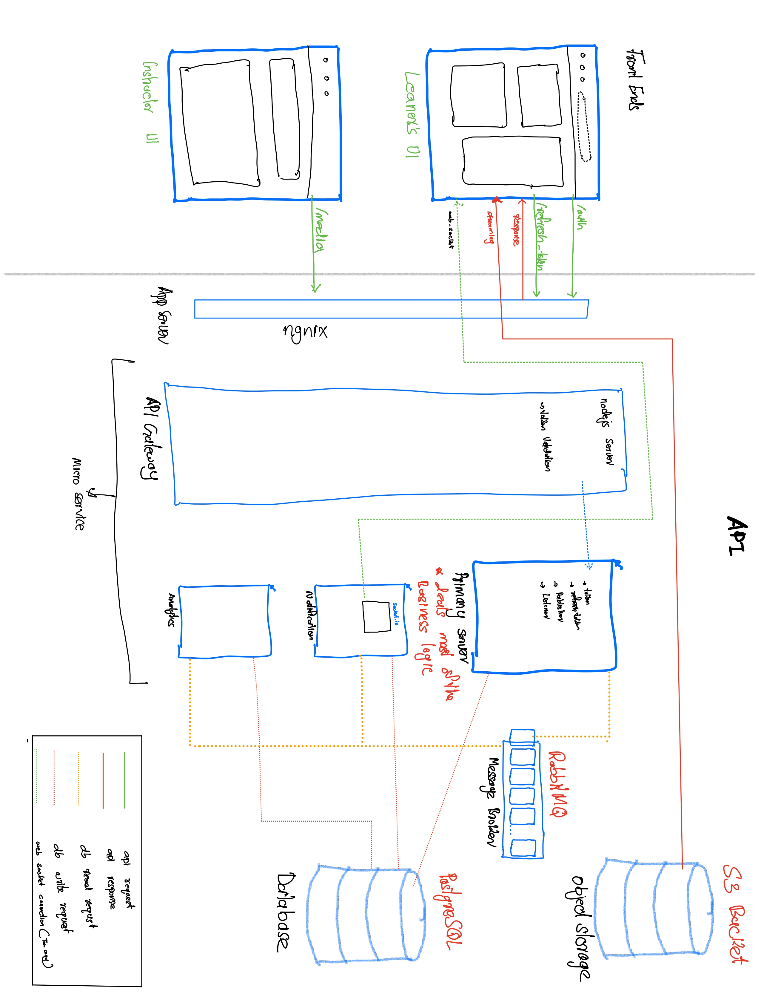

# Learning Management System (LMS)

A comprehensive Learning Management System (LMS) designed to facilitate learning and knowledge transfer within companies and support freelance tutors. This platform addresses the need for an accessible and efficient LMS in small companies. It offers robust features for both learners and instructors.

#### Full System Architecture.


#### Credentials
``` 
    Instructor
    email: ajmal@test.com
    password: 123

    Student
    email: s1@student.com
    password: 12345678
 ```
## Features and Functionality
- **Video Course Support**: Enables the creation and consumption of video courses.
- **Learner Dashboard**: Provides learners with an overview of their progress and activities.
- **Playback Tracking and Resume**: Allows learners to resume video playback from where they left off.
- **Time Spent Tracking**: Tracks the time learners spend on each course.
- **Progress Tracking**: Monitors and displays learners' progress through courses.
- **Course Creation for Instructors**: Instructors can create courses, upload video lectures, and add document attachments related to the videos.
- **Microservices Architecture**: Ensures scalability and maintainability.
- **RabbitMQ Integration**: Facilitates efficient and reliable communication between services.
